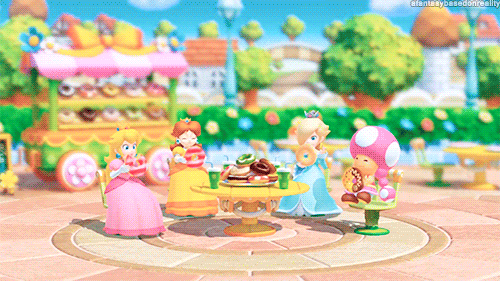

# Mario and Friends Clicky Game Party

A Simple memory game built with React.js

## Motive

The motive of creating this application was to study and understand the foundations of how React.js can be effectively used in Web Development.

## Getting Started

<b>To get started:</b>
 
:black_small_square: You will need to have an updated IDE (preferably VS Code), and the latest version of Node.js (as well as latest npm version), and an up-to-date version of React.

### Prerequisites

:black_small_square: IDE: Microsoft Visual Studios 1.37.1 (or higher).
 
:black_small_square: Node.js (Version: 12.13.0 or higher)
 
:black_small_square: React.js
 
:black_small_square: Heroku - Container-based cloud Platform as a Service (PaaS). Heroku enables developers to build, run, and operate applications entirely in the cloud.

## Code Explanation:

## How To Use The Application:

1. The anatomy of the application is depicted as the following:
   a. node_modules contain the dependencies used in the application.
   b. public folder primarily contain the front-end files (.png, .gif, .html, .ico) and folder - images
   c. src contains the components folder as well as the application logic, css and the data itself.
    i. components folder contained the following:
      1. Card (which is the folder that holds the characters card)
      2. Header contained the title and score front-end
      3. Wrapper was the "container" that held the cards together.
   d. .gitignore (ignores the node_modules folder when conducting the add, commit and push commands)
   e. LICENSE - standard license under the MIT
   f. package-lock/package.json contain the downloaded npm dependencies utilized for this application.

## Deployment

- <b> 'git push origin master' & 'git push heroku master' the files into GitHub Profile and Heroku respectively.</b>
- <b> Link repository and Heroku deployment link to BCS.</b>

## Built With

 
:black_small_square: Microsoft Studios Visual Code (v1.37.1)
 
:black_small_square: Google Chrome v77.0.3865.90+(Windows)
 
:black_small_square: Node.js v12.11.0
 
:black_small_square: npm v6.13
 
:black_small_square: ShareX v12.4.1 - Screen Record User Functionality and converts to GIFs

## npm Packages Used:

* "react": "^16.11.0",
* "react-dom": "^16.11.0",
* "react-scripts": "3.2.0"

## Author

**Micah Andres** - [mandres2](https://github.com/mandres2)

## License

<b>This project is licensed under the MIT License</b>

## Acknowledgments & Support

- <b>TAs</b> - Catherine Pham, Benjamin Vaagen

 

- <b>Teacher</b> - Arron Linton

## Progress Log

 
:heavy_check_mark: 11.5 - Read requirements and establish repository and README. Created React App and started working on structure and organization of the application
 
:heavy_check_mark: 11.6 - Review class activities. Created files nested within Card, Header, and Wrapper folder. Focused coding back-end on App
 
:heavy_check_mark: 11.7 - Rendered objects and started testing out game. Testing game
 
:heavy_check_mark: 11.8 - Debugging and Testing. Fixing Front-end interfaces
 
:heavy_check_mark: 11.9 - Polishing application and deployment of application